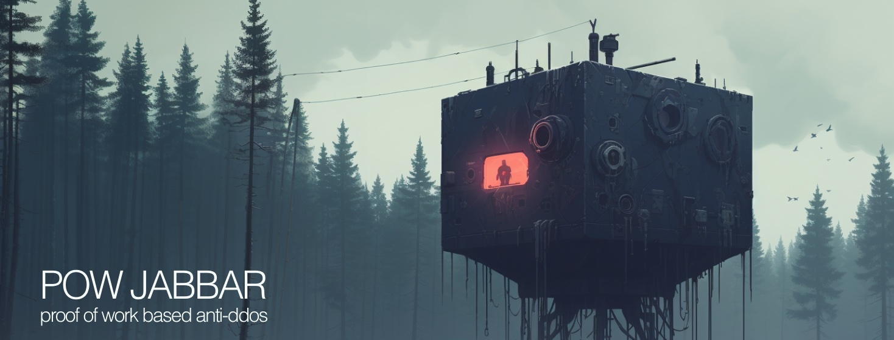

## [](https://github.com/1F47E/go-pow-jabbar/actions/workflows/go.yml)  [](https://goreportcard.com/report/1F47E/go-pow-jabbar)

# WIP
v 0.0.1 coming soon

## Anti DDOS via Proof of Work

PoW Jabbar is API library, implementing a security protocol that requires clients to perform a proof-of-work computation to gain access to main access point. 

The also is similar to Adam Back's Hashcash system, the same as used in bitcoin. 

By ensuring requests are computationally costly for the client but lightweight for the server, the system effectively counters denial-of-service and spam attacks.

## Features

### Asynchronous Proof-of-Work Challenge
Utilizing the SHA-256 hashing algorithm, the system require the computational proof-of-work to be executed solely on the client side, making it resource-intensive for the requester but cheap for the server.

### Stateless Challenge Design
Challenges are self-contained and do not require any external storage. This design allows high level of scalability and performance. All data required for validation are baked into the challenge itself.

### Challenge data format
```
   DIFFICULTY | TIMESTAMP  | NONCE     | SIGNATURE
              |            |           |
   4          | 16920659...| 5996206...| 7814f500270011d762...
              |            |           |
   1 byte     | 8 bytes    | 8 byte    | 32 bytes
```

### Difficulty
Difficulty is a number of leading zeros in the hash. The more leading zeros the more difficult to find a solution. Level 4 is a recommended level for most applications.
```
3 - 1+ms
4 - 20-50ms
5 - 100-200ms
6 - 15+ sec
7 - 30+ sec
```


### Timestamp Detection

Each request is timestamped to ensure timely submissions, limiting the window of access and preventing outdated challenges.

### HMAC Signature

To safeguard against replay attacks, each request incorporates an HMAC signature, ensuring that the request is both untampered and unique.


### Client-Side Implementation

With SHA-256 challange its easy for client-side implementation using JavaScript (see solver.js).

### Inspiration
Heavely insipred by Islam Bekbuzarov and his https://github.com/blkmlk/ddos-pow

### Links
https://en.wikipedia.org/wiki/Hashcash


### Benchmark
```
BenchmarkVerification-10      	14581705	        81.23 ns/op
BenchmarkNewChallenge-10    	 1382676	       867.6 ns/op
```

### TODO
- [ ] Add tests
- [ ] Add examples with HTTP server
- [ ] add releaser scripts 
- [ ] build online example with front end
- [ ] add react npm package for solver
